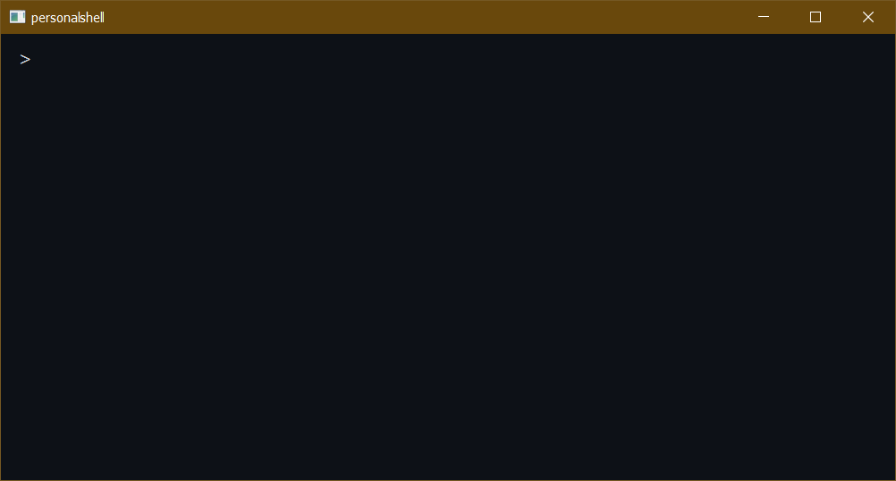
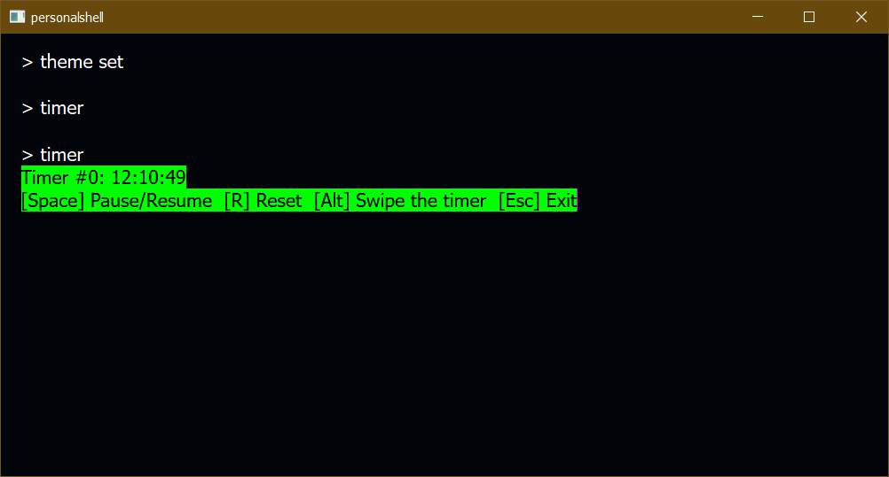
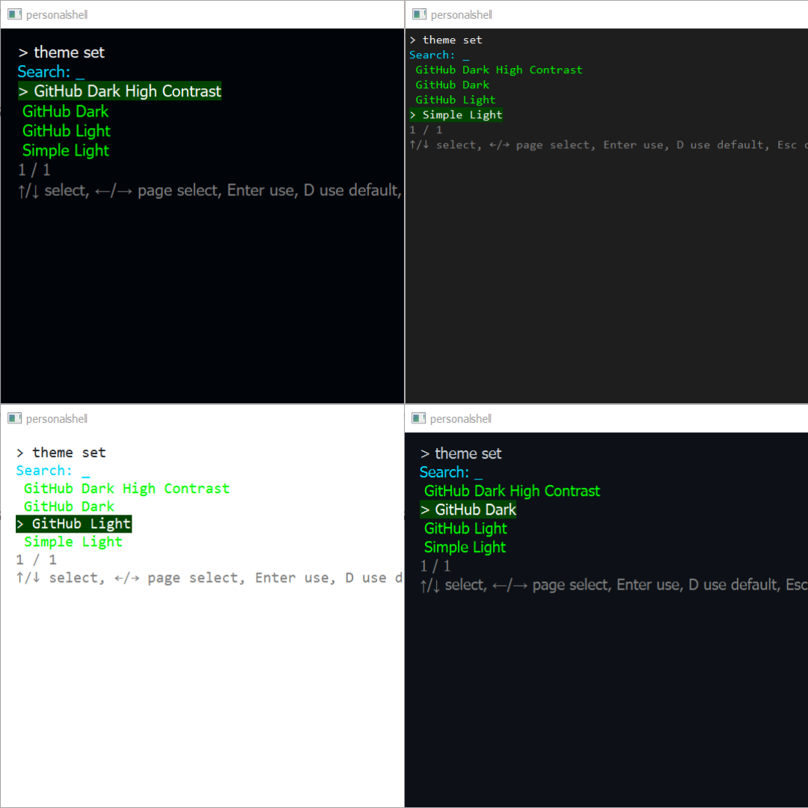
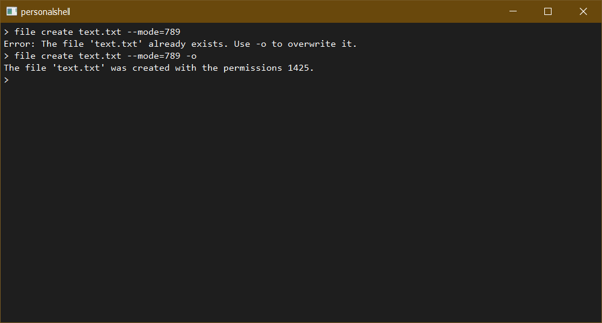

<p align="center">
  
</p>
  <h1 align="center">
  PersonalShell
</h1>
<p align="center">
  Персональна консоль з власними командами, створена на основі PyQt6
</p>
<div align="center">

[]()
[]()
[]()
[]()

</div>


**PersonalShell** — це персональна консоль з власними командами, створена на основі PyQt6. Додаток надає повнофункціональну командну оболонку з підтримкою тем, плагінів, віджетів та розширеної системи команд.

## 🎥 Демонстрація роботи

### Відео огляд
<!-- Замініть посилання нижче на ваше власне відео -->


### Що показано у відео:
- Запуск додатку та базовий інтерфейс
- Виконання основних команд
- Робота з віджетами (таблиці, кнопки, чекбокси)
- Перемикання між темами оформлення
- Використання таймерів та секундомірів
- Робота з файловою системою
- Створення та використання плагінів

### Скріншоти

<details>
<summary>Розгорнути галерею скріншотів</summary>

#### Головний інтерфейс

*Головний інтерфейс PersonalShell з темою GitHub Dark*

#### Робота з віджетами

*Демонстрація інтерактивних віджетів: таймер*

#### Система тем

*Порівняння різних тем: GitHub Dark, GitHub Light, Simple Light*

#### Команди та автодоповненн

*Виконання команд з підтримкою аргументів та прапорців*

</details>

---

## 🚀 Особливості

- **Консольний інтерфейс** на базі PyQt6 з підтримкою тем
- **Система команд** з підтримкою підкоманд, аргументів та прапорців
- **Теми оформлення** з можливістю наслідування та перевизначення
- **Плагіни** для розширення функціональності
- **Віджети** для інтерактивних елементів інтерфейсу
- **Сесії** зі збереженням історії команд
- **Конфігурація** через YAML файли
- **Логування** дій користувача

## 📦 Встановлення

### Вимоги
- Python 3.8+
- PyQt6
- PyYAML

### Встановлення залежностей
```bash
pip install PyQt6 PyYAML
```

### Запуск
```bash
python main.py
```

## 🏗️ Архітектура проекту

### Структура проекту
```
PersonalShell/
├── main.py                    # Точка входу в додаток
├── config/
│   └── config_user.yaml       # Користувацька конфігурація
├── src/
│   ├── config/
│   │   └── config_base.yaml   # Базова конфігурація
│   ├── ui/
│   │   ├── console.py         # Головний консольний віджет
│   │   └── theme.py           # Система тем
│   ├── core/
│   │   ├── appcontext.py      # Контекст додатку (Session, Config)
│   │   ├── executor.py        # Виконавець команд
│   │   ├── logger.py          # Система логування
│   │   ├── parser.py          # Парсер команд
│   │   └── register.py        # Реєстратор команд
│   ├── modules/
│   │   ├── command.py         # Базовий клас команд
│   │   ├── plugin.py          # Базовий клас плагінів
│   │   └── widgets/           # Система віджетів
│   │       ├── widget.py      # Базовий клас віджетів
│   │       ├── buttons.py     # Віджети кнопок
│   │       ├── checkbox.py    # Віджети чекбоксів
│   │       ├── searchlist.py  # Пошукові списки
│   │       ├── slider.py      # Повзунки
│   │       └── table.py       # Таблиці
│   └── commands/              # Вбудовані команди
│       ├── calendar/          # Календарні команди
│       ├── essentials/        # Основні команди
│       ├── faq/              # Довідкова система
│       ├── file_system/      # Файлова система
│       ├── stopwatch/        # Секундоміри
│       ├── theme/            # Управління темами
│       └── timer/            # Таймери
├── themes/                   # Файли тем
│   ├── github-dark.yaml
│   ├── github-light.yaml
│   └── simple-light.yaml
├── plugins/                  # Користувацькі плагіни
├── session/                  # Файли сесій
│   └── session.json
├── logs/                     # Логи додатку
│   └── pccl.log
├── screenshots/              # Скріншоти для документації
│   ├── main-interface.png
│   ├── widgets-demo.png
│   ├── theme-comparison.png
│   └── commands-demo.png
└── ico/                      # Іконки додатку
    ├── personalshell_ico1.png
    ├── personalshell_ico2.png
    └── personalshell_ico3.png
```

## 🎯 Основні компоненти

### 1. Головне вікно (`main.py`)

```python
import sys, os
from PyQt6.QtWidgets import QApplication, QMainWindow
from PyQt6.QtCore import Qt
from pathlib import Path
from src.ui.console import Console

class MainWindow(QMainWindow):
    def __init__(self):
        super().__init__()
        self.setWindowTitle("personalshell")
        self.setCentralWidget(Console())
        self.resize(800, 400)

if __name__ == "__main__":
    app = QApplication(sys.argv)
    window = MainWindow()
    window.show()
    app.exec()
```

### 2. Консоль (`src/ui/console.py`)

Головний віджет консолі, який:
- Обробляє введення користувача
- Керує виведенням команд
- Інтегрує системи парсингу та виконання команд
- Підтримує віджети для інтерактивних елементів

**Ключові особливості:**
- Обробка клавіш `Enter`, `Backspace`
- Підтримка інтерактивних віджетів
- Інтеграція з системою тем
- Контроль позиції курсору

### 3. Система команд

#### CommandParser (`src/core/parser.py`)
Парсер команд підтримує:
- **Позиційні аргументи**: `command arg1 arg2`
- **Іменовані аргументи**: `command --param=value`
- **Прапорці**: `command -f -v`
- **Рядки в лапках**: `command "string with spaces"`

Приклад парсингу:
```bash
> mycommand arg1 --param=value -f "quoted string"
```

Результат парсингу:
```python
{
    "input_string": "mycommand arg1 --param=value -f \"quoted string\"",
    "parse": {
        "command": "mycommand",
        "args": ["arg1", "quoted string"],
        "kwargs": {"param": "value"},
        "flags": ["f"]
    }
}
```

#### Command Base Class (`src/modules/command.py`)
```python
from src.modules.command import Command

class MyCommand(Command):
    def __init__(self):
        super().__init__()
        self.name = "mycommand"
        self.description = "Опис команди"
        self.aliases = ["mc", "my"]
        self.is_subcommand = False
    
    def execute(self, parse, context):
        # Логіка виконання
        return "Результат команди"
```

#### CommandExecutor (`src/core/executor.py`)
Виконавець команд який:
- Реєструє команди з реєстру
- Виконує команди за їхніми іменами
- Обробляє помилки виконання
- Повертає результати виконання

#### CommandRegistry (`src/core/register.py`)
Реєстратор команд який:
- Автоматично завантажує команди з модулів
- Підтримує плагіни
- Керує псевдонімами команд
- Ініціалізується з конфігурації

### 4. Система тем (`src/ui/theme.py`)

#### Структура теми (YAML)
```yaml
meta:
  name: "My Theme"
  author: "Author Name"
  version: "1.0"
  description: "Опис теми"

# Наслідування від базової теми
base: "GitHub Dark"

font:
  family: "Consolas"
  size: 10
  weight: 300
  italic: false

colors:
  background: "#1a1a1a"
  color: "#ffffff"
  selection_color: "#464040"

scrollbar:
  background: "#282828"
  width: 10
  margin: 0
  background_handle: "#ffffff"
  height_handle: 10
  border_radius_handle: 0

border: "0px black solid"
padding: "0px"
border_radius: "0px"
```

#### Компоненти системи тем:

**ThemeLoader** - завантажує теми з файлів:
- Підтримує наслідування тем через `base`
- Застосовує перевизначення з конфігурації
- Об'єднує базові теми з користувацькими

**ThemeApplier** - застосовує теми до віджетів:
- Налаштовує шрифти
- Застосовує кольорові схеми
- Стилізує скролбари
- Встановлює відступи та рамки

**ThemeManager** - керує темами:
- Ініціалізує завантажувач та застосовувач
- Надає методи для перемикання тем
- Зберігає поточну тему

### 5. Віджети (`src/modules/widgets/`)

Система віджетів для створення інтерактивних елементів:

#### Базовий клас Widget (`src/modules/widgets/widget.py`)
```python
from src.modules.widgets.widget import Widget

class MyWidget(Widget):
    def __init__(self, console):
        super().__init__(console)
    
    def _render(self):
        # Відображення віджета
        super()._render()
        cursor = self.console.textCursor()
        cursor.insertText("Вміст віджета")
    
    def handle_key(self, event):
        # Обробка клавіш
        if event.key() == Qt.Key.Key_Escape:
            self.stop("remove")
            return True
        return False

# Використання
widget = MyWidget(console)
widget.show()
```

#### Доступні віджети:
- **buttons.py** - Кнопки та групи кнопок
- **checkbox.py** - Чекбокси для вибору опцій
- **searchlist.py** - Списки з пошуком
- **slider.py** - Повзунки для числових значень
- **table.py** - Таблиці для відображення даних

#### Методи зупинки віджета:
- `deactivate` - деактивувати, залишити вміст
- `remove` - видалити з новим рядком
- `remove_nonewline` - видалити без нового рядка
- `hide` - сховати з новим рядком
- `hide_nonewline` - сховати без нового рядка

### 6. Контекст додатку (`src/core/appcontext.py`)

#### AppContext
Об'єднує всі компоненти системи:
```python
@dataclass
class AppContext:
    session: Session        # Сесія користувача
    config: Config         # Конфігурація
    console: Any          # Консольний віджет
    command_registry: Any # Реєстр команд
```

#### Config
Система конфігурації з підтримкою:
- Базової та користувацької конфігурацій
- Глибокого об'єднання налаштувань
- Шляхів до модулів та плагінів
- Налаштувань інтеграцій

#### Session (`src/core/session.py`)
Керування сесією користувача:
- Збереження змінних сесії
- Змінні середовища
- Історія команд
- Автоматичне збереження в JSON

### 7. Логування (`src/core/logger.py`)

Система логування з підтримкою:
- Запису в файл та консоль
- Простого логування команд
- Детального JSON логування
- Різних рівнів логування

```python
logger = Logger("./logs")
logger.log_command_brief("mycommand")
logger.log_command_json(parse, context, success=True, result="OK")
```

## 🔧 Створення команд

### Проста команда
```python
from src.modules.command import Command

class HelloCommand(Command):
    def __init__(self):
        super().__init__()
        self.name = "hello"
        self.description = "Привітання користувача"
        self.aliases = ["hi", "greet"]
    
    def execute(self, parse, context):
        args = parse['parse']['args']
        name = args[0] if args else "World"
        return f"Привіт, {name}!"
```

### Команда з підкомандами
```python
class GitCommand(Command):
    def __init__(self):
        super().__init__()
        self.name = "git"
        self.description = "Git-подібна команда"
        self.subcommands = {
            "status": GitStatusCommand(),
            "commit": GitCommitCommand()
        }
    
    def execute(self, parse, context):
        args = parse['parse']['args']
        if args and args[0] in self.subcommands:
            return self.subcommands[args[0]].execute(parse, context)
        return self.help()

class GitStatusCommand(Command):
    def __init__(self):
        super().__init__()
        self.name = "status"
        self.description = "Показати статус"
        self.is_subcommand = True
    
    def execute(self, parse, context):
        return "Статус репозиторію"
```

## 🎨 Створення тем

### Базова тема
```yaml
# themes/my_theme.yaml
meta:
  name: "My Custom Theme"
  author: "Your Name"
  version: "1.0"
  description: "Моя користувацька тема"

font:
  family: "JetBrains Mono"
  size: 12
  weight: 400

colors:
  background: "#2d3748"
  color: "#e2e8f0"
  selection_color: "#4a5568"

scrollbar:
  background: "#1a202c"
  background_handle: "#4a5568"
  width: 8
  margin: 2
  height_handle: 15
  border_radius_handle: 4

border: "1px solid #4a5568"
padding: "8px"
border_radius: "6px"
```

### Тема з наслідуванням
```yaml
# themes/my_dark_theme.yaml
meta:
  name: "My Dark Theme"
  author: "Your Name"
  version: "1.0"

base: "GitHub Dark"

colors:
  background: "#0d1117"
  color: "#58a6ff"
  selection_color: "#1f6feb"

font:
  size: 11
```

## 🔌 Створення плагінів

```python
# plugins/my_plugin.py
from src.modules.plugin import Plugin
from src.modules.command import Command

class MyPluginCommand(Command):
    def __init__(self):
        super().__init__()
        self.name = "myplugin"
        self.description = "Команда з плагіна"
        self.aliases = ["mp"]
    
    def execute(self, parse, context):
        return "Плагін працює!"

class MyPlugin(Plugin):
    def __init__(self):
        super().__init__()
        self.name = "MyPlugin"
        self.version = "1.0.0"
        
    def validate_config(self):
        # Валідація конфігурації плагіна
        pass
```

## 🖥️ Створення віджетів

### Інтерактивна таблиця
```python
from .widget import Widget
from PyQt6.QtGui import QTextCursor, QColor, QTextCharFormat, QKeyEvent
from PyQt6.QtCore import Qt

class DropdownMenu:
    def __init__(self, console, headers, data):
        self.console = console
        self.headers = headers
        self.data = data
        self.rows = len(data)
        self.cols = len(headers)
        self.row = 0
        self.col = 0
        self.active = True
        self.start_pos = 0
        
        self.formats = {
            'header': self._create_format("#496349"),
            'selected': self._create_format("#00FF00"),
            'normal': self._create_format("#966565")
        }

    def _render(self):
        self._clear()
        cursor = self.console.textCursor()
        cursor.setPosition(self.get_start_pos())

        col_widths = [max(len(str(row[i])) for row in self.data) for i in range(self.cols)]
        col_widths = [max(col_widths[i], len(self.headers[i])) + 2 for i in range(self.cols)]
        def fmt_cell(text, width):
            return f"{str(text):<{width}}"

        header_row = "".join(fmt_cell(self.headers[i], col_widths[i]) for i in range(self.cols)) + "\n"
        cursor.insertText(header_row, self.formats['header'])

        for r in range(self.rows):
            for c in range(self.cols):
                text = fmt_cell(self.data[r][c], col_widths[c])
                if r == self.row and c == self.col and self.active:
                    cursor.insertText(text, self.formats['selected'])
                else:
                    cursor.insertText(text, self.formats['normal'])
            cursor.insertText("\n")
        self.console.setTextCursor(cursor)
        


    def handle_key(self, key: int) -> bool:
        if not self.active:
            return False

        moved = False
        if key == Qt.Key.Key_Left:
            self.col = max(0, self.col - 1)
            moved = True
        elif key == Qt.Key.Key_Right:
            self.col = min(self.cols - 1, self.col + 1)
            moved = True
        elif key == Qt.Key.Key_Up:
            self.row = max(0, self.row - 1)
            moved = True
        elif key == Qt.Key.Key_Down:
            self.row = min(self.rows - 1, self.row + 1)
            moved = True
        elif key == Qt.Key.Key_Return:
            self._select_item(self.data[self.row][self.col])
            self.stop("remove")
            self.console._add_prompt()
            return True
        elif key == Qt.Key.Key_Escape:
            self.stop("remove")
            return True

        if moved:
            self._render()
            return True
        return False


    def _select_item(self, result):
        print(result)
        self.remove()

    def stop(self):
        pass
```

## ⚙️ Конфігурація

### config_base.yaml (базова конфігурація)
```yaml
app:
  name: PersonalShell
  version: 0.5.0
  env: production
  debug: false

paths:
  commands:
    - ./src/commands
    - ./plugins
  theme:
    - ./themes
  logs: ./logs
  session: ./session

modules:
  core:
    - src.commands.essentials
    - src.commands.theme
    - src.commands.timer
    - src.commands.calendar
    - src.commands.file_system
    - src.commands.faq
    - src.commands.stopwatch
  plugins: null

user:
  theme:
    current: "Simple Light"
    available:
      - "GitHub Dark"
      - "GitHub Light" 
      - "Simple Light"
      - "GitHub Dark High Contrast"
  history_size: 1000
  auto_update: true

logging:
  level: INFO
  format: '%(asctime)s | %(levelname)-8s | %(module)s: %(message)s'

locale:
  language: uk_UA
  timezone: Europe/Kiev
```

### config_user.yaml (користувацька конфігурація)
```yaml
user:
  theme:
    current: "GitHub Dark"
    override:
      font:
        size: 12
      colors:
        background: "#0d1117"

logging:
  level: DEBUG

# Додаткові налаштування користувача
```

## 📝 Вбудовані команди

PersonalShell постачається з набором вбудованих команд:

### essentials (основні команди)
- **env** - керування змінними середовища
- **meta** - інформація про додаток
- **output** - керування виведенням
- **sctrl** - системне керування

### theme (керування темами)
- Перемикання між темами
- Перегляд доступних тем
- Налаштування тем

### timer (таймери)
- Створення та керування таймерами
- Зворотний відлік
- Нагадування

### calendar (календарні функції)
- Відображення календаря
- Планування подій
- Нагадування про дати

### file_system (файлова система)
- Навігація по файловій системі
- Операції з файлами
- Пошук файлів

### faq (довідкова система)
- Довідка по командах
- Поширені питання
- Документація

### stopwatch (секундоміри)
- Секундомір
- Підрахунок часу
- Збереження результатів

## 🛠️ Розробка

### Додавання нової команди
1. Створіть новий файл в `src/commands/`
2. Наслідуйте від класу `Command`
3. Реалізуйте метод `execute`
4. Додайте модуль до конфігурації

### Додавання нового віджета
1. Створіть новий файл в `src/modules/widgets/`
2. Наслідуйте від класу `Widget`
3. Реалізуйте методи `_render` та `handle_key`
4. Імпортуйте в команди за потреби

### Створення теми
1. Створіть YAML файл в папці `themes/`
2. Визначте метадані та стилі
3. Додайте тему до списку доступних в конфігурації

## 🐛 Налагодження

### Увімкнення режиму налагодження
```yaml
# config_user.yaml
app:
  debug: true

logging:
  level: DEBUG
```

### Логування
Логи зберігаються в папці `logs/` з автоматичною ротацією. Підтримуються різні рівні логування:
- `DEBUG` - детальна інформація
- `INFO` - загальна інформація
- `WARNING` - попередження
- `ERROR` - помилки

## 🚀 Розширення функціональності

### Інтеграції
PersonalShell підтримує інтеграції з зовнішніми сервісами через конфігурацію:

```yaml
integrations:
  api_service:
    url: "https://api.example.com"
    token: "your_token"
    enabled: true
```

### Автозавантаження
Система автоматично завантажує:
- Команди з вказаних модулів
- Плагіни з папки plugins
- Теми з папки themes
- Конфігурації з config/

## 🤝 Внесок у проект

1. Зробіть форк репозиторію
2. Створіть гілку для нової функції
3. Внесіть зміни
4. Додайте тести
5. Створіть Pull Request

## 📄 Ліцензія

MIT License - дивіться файл LICENSE для деталей.

## 🆘 Підтримка

- Створіть Issue в GitHub для повідомлення про помилки
- Використовуйте Discussions для питань та пропозицій
- Читайте вбудовану довідку: команда `help`

---

**PersonalShell** - створіть свою ідеальну командну оболонку! 🚀